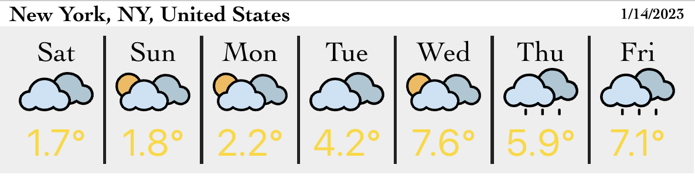

# Weather Widget

This is a simple widget for an embedded dashboard or magic mirror device. It requires an `apiKey` from Visual Crossing to access its weather data.

## Setup

To use, you can simply take use the URL from GitHub pages, here:

Add your own `apiKey` from [visualcrossing](https://visualcrossing.com) to the url and a location. An example follows:

    https://rmccrear.github.io/weather-widget?apiKey=YOUR_API_KEY&location=New%20York%20City%20NY

To use as a widget in an iFrame, you can use this code:

    <iframe style="width: 37em;" src="https://rmccrear.github.io/weather-widget/?location=new%20york%20city&apiKey=YOUR_API_KEY"></iframe>

It will look something like this.

## Contributing

You can start a development version of this widget by cloning it. It is a Create React App, so you can start it in the normal way with...

    npm install
    npm start

To get weather data, you must use a ViusalCrossing api key. You can sign up for one for free at [visualcrossing.com](https://visualcrossing.com)